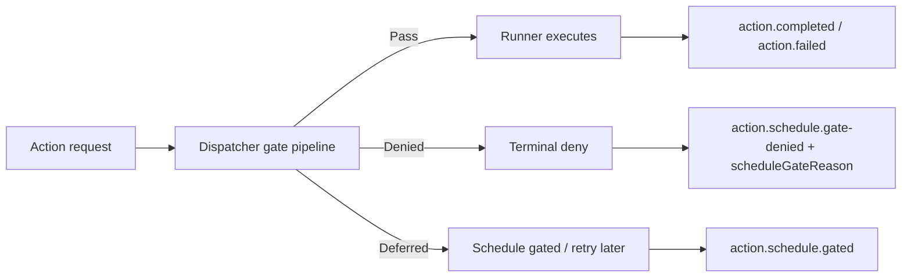

# Action gating map

This document explains how the centralized gating pipeline classifies a request
before a capability runner executes.

It is the canonical mapping for:

- **happy path**: request is allowed and reaches the runner
- **denied**: request is blocked permanently by a gate
- **deferred / gated**: request is not executed now, but is not a failure

## Actors

| Actor | Responsibility |
|---|---|
| Web intake | Validates the request, resolves identity, enqueues the action |
| Proc dispatcher | Runs the gate pipeline before dispatching to a runner |
| Gate pipeline | Applies cross-cutting policy: schedule/wave, device group, user group |
| Runner | Executes only the capability-specific work |
| Client | Shows the user-facing outcome |
| Portal | Aggregates denied/deferred telemetry and audit |

## Decision model

The important invariant is that **policy happens before execution**.
Capability runners must never re-implement group or wave checks.

## Event catalog

> **Important**: every gate denial (schedule/wave, device group, user group,
> device resolution) emits the **same** event `action.schedule.gate-denied`.
> The actual cause travels in the `scheduleGateReason` property, NOT in the
> event name. Do not assume a distinct `action.denied.<reason>` event for each
> gate — see the reason-code catalog for the reason values.

| Event | Meaning | Terminal? | Notes |
|---|---|---:|---|
| `action.request.received` | Request entered the system | No | Intake boundary |
| `action.request.accepted` | Request passed intake and was queued | No | Pre-dispatch |
| `action.dispatch.received` | Dispatcher consumed the envelope | No | Internal pipeline signal |
| `action.schedule.gate-denied` | A gate denied the request (reason in `scheduleGateReason`) | Yes | Counts as denied |
| `action.schedule.gated` | Request is deferred by schedule policy | No | Not a failure |
| `action.denied.device-resolve-failed` | Device object id resolution failed pre-gate | Yes | Emitted by the dispatcher pre-gate path |
| `action.denied.device-not-in-entra` | Entra device lookup returned empty pre-gate | Yes | Emitted by the dispatcher pre-gate path |
| `action.completed` | Capability finished successfully | Yes | Normal terminal success |
| `action.failed` | Capability failed permanently | Yes | Normal terminal failure |
| `action.poll-timeout` | Poller could not observe a terminal state | Yes | Operational timeout |

> Note: a few `action.denied.*` events (e.g. `action.denied.device-resolve-failed`,
> `action.denied.device-not-in-entra`) are still emitted directly by the
> dispatcher's pre-gate device-resolution path. Group/wave denials decided by
> the gate pipeline always surface as `action.schedule.gate-denied`.

## Semantics

### Pass

The request is allowed to continue to the runner. No special UI handling is
needed beyond normal progress and success states.

### Denied

The request is rejected permanently by a gate. The client should show the
reason, and the portal should count it in denied metrics.

Typical reasons:

- not in the enrolled wave
- device not in the allowed group
- user not in the allowed group
- device binding / identity mismatch
- a gate errored while the policy is fail-closed (`denied:gate-error`,
  `denied:schedule-lookup-failed`)

### Deferred

The request is not executed now, but the system is not saying "never".
The user-facing copy should be closer to "outside the current wave, retry
later" than to "blocked".

## Consumer rules

### Client

- show denied reasons explicitly
- keep deferred/schedule-gated separate from denied
- use the correlation id as the support anchor

### Portal

- include `action.schedule.gate-denied` in denied breakdowns
- use `scheduleGateReason` when `reason` is missing
- treat deferred events as a different class from denied

### Telemetry

- do not rely only on `action.denied.*`
- always include the schedule gate event explicitly
- query by exact event name when the distinction matters

## Configuration

The gating pipeline is driven entirely from App Configuration so that enabling a
capability or changing failure posture never requires a code change:

| Key | Default | Purpose |
|---|---|---|
| `Actions:GatedTypes` | `wipe` | CSV of action types that run the gate pipeline even without group config (e.g. schedule-only gates). Add a new capability's type here to gate it — no dispatcher edit. |
| `Actions:ConfigSection:<actionType>` | built-in map | Overrides the config section a capability reads its `AllowedGroupId` / `GatingMode` from. Defaults: `wipe→Wipe`, `bitlocker-rotate→BitLocker`, `autopilot-register→Autopilot`, `device-rename→Rename`; otherwise the action type itself. |
| `Actions:GateErrorPolicy` | `fail-closed` | Behaviour when a gate errors unexpectedly (or the schedule store is unavailable). `fail-closed` denies the action (safe for destructive actions); `fail-open` lets it through (availability over safety). |
| `<Section>:AllowedGroupId` | — | Entra group id for the device-membership gate. |
| `<Section>:AllowedUserGroupId` | — | Entra group id for the caller-membership gate. |
| `<Section>:GatingMode` | `DeviceOnly` | `DeviceOnly` / `UserOnly` / `Both` / `Either`. |

> **Capability-agnostic invariant**: the dispatcher no longer hardcodes any
> capability name. A new gated capability `foo` needs only (a) its
> `IActionGate`/runner registered in `Proc/Program.cs` (composition root), and
> (b) the App Config keys above — never an edit to `ActionDispatchFunction`.

### Per-capability gating posture

Cross-cutting group/wave gating lives **only** in the dispatcher pipeline. No
capability runner re-implements it; runners perform only their own privileged,
capability-specific checks (ownership, payload validation, idempotency).

| Capability | Central group/wave gate | Runner-side checks (privileged) |
|---|---|---|
| `wipe` | Schedule (wave) + device/user group gate (`Wipe:*`) | device-resolve, ownership, ledger, post-wipe nudges |
| `bitlocker-rotate` | Device group gate (`BitLocker:AllowedGroupId`, required) | device-resolve, ownership, ledger |
| `device-rename` | Optional device/user group gate (set `Rename:AllowedGroupId` to enable) | serial/intuneId validation, CMDB lookup, collision check, ledger |
| `autopilot-register` | **None by design** — runs on fresh hardware with no Entra device object | hardware-hash payload validation, ledger |

> **Do not** set `Autopilot:AllowedGroupId` (or add `autopilot-register` to
> `Actions:GatedTypes`): the device-group gate resolves the Entra device object,
> which Autopilot hardware does not yet have, so every registration would be
> denied with `denied:device-not-in-entra`.

### Wave membership: individual rows OR Entra group (sufficient condition)

The wipe schedule gate (`WipeScheduleGate`) decides whether a device is enrolled
in a wave. A wave can declare its membership two ways, and **either one is
sufficient** — they are unioned, never intersected:

| Membership source | How it is stored | How it is resolved at gate time |
|---|---|---|
| **Individual device** | a row in the wave's members table (`RowKey = entraDeviceId`) | cross-partition table scan by RowKey |
| **Entra group** | `WipeScheduleWave.EntraGroupId` on the wave | Graph `checkMemberGroups` against the device's directory object, in real time |

So for a wave configured with **both** an Entra group **and** individually-added
devices, the gate considers the **union**: a device passes the wave check if it
is in the members table **OR** it belongs to the wave's Entra group. Group
membership alone enrolls the device even with no individual row; an individual
row alone enrolls it even if it is not in any group. A wave matched through both
paths is de-duplicated by wave id.

> **Operator guidance**: adding a device to a wave's Entra group is equivalent
> to adding it individually — both grant enrollment. Removing the individual row
> does **not** revoke enrollment if the device is still in the group, and vice
> versa. To exclude a device entirely, remove it from **both** the member list
> and the wave's Entra group.

This union is computed in one place — `WipeScheduleStore.GetScheduleForDeviceAsync`
— and shared by **both** the enforcement gate (Proc) and the advisory
`GET /api/schedule/me` endpoint (Web), so the client preview and the server
decision can never disagree. The only behavioural difference is error handling:
Graph failures **propagate** on the enforcement path (so `Actions:GateErrorPolicy`
applies — `fail-closed` by default) but are **swallowed to null** on the advisory
read path (a failing provider must not break the aggregator).

#### Relationship to the classic group gate

Per-wave `EntraGroupId` is **not** the same thing as the capability-wide
`<Section>:AllowedGroupId` consumed by `DeviceGroupMembershipGate`. They are two
independent gates in the pipeline (evaluated in order: `WipeScheduleGate` →
`DeviceGroupMembershipGate` → `UserGroupMembershipGate`):

| | Per-wave `EntraGroupId` | `Wipe:AllowedGroupId` (classic) |
|---|---|---|
| Scope | one wave | the whole capability |
| Gate | `WipeScheduleGate` | `DeviceGroupMembershipGate` |
| Role | **enrolls** a device into a specific wave (temporal "when") | **allowlists** which devices may ever be wiped (authorization "whether") |
| Effect of membership | sufficient to be *in the wave* | required to *pass the allowlist* |

A device must satisfy **both** gates to proceed: it has to be enrolled in an
active wave (via individual row or wave group) **and** — if `Wipe:AllowedGroupId`
is configured — be a member of the capability allowlist group. The two are
ANDed because they answer different questions; only the wave's two membership
sources are ORed.

### Runbook-backed variants

Runbook executors (Azure Automation) run **downstream** of this same dispatcher,
so group/wave gating is centralized identically — the runbook body no longer
checks group membership. A runbook actionType carrying a `-runbook` suffix
(e.g. `wipe-runbook`, `bitlocker-rotate-runbook`) inherits its base capability's
config section in `GetActionConfig`, so the central gate enforces
`Wipe:AllowedGroupId` / `BitLocker:AllowedGroupId` from App Configuration.

> **Deployment requirement**: when attaching a runbook-backed capability via
> `RunbookBridge:Routes:<actionType>`, configure the base capability's
> `<Section>:AllowedGroupId` in App Configuration to enable group gating. The
> legacy Automation Variables `AllowedGroupId` / `BitLockerAllowedGroupId` are
> no longer the gating authority.

## Reference implementation

- `src/Proc/Functions/ActionDispatchFunction.cs`
- `src/Shared/Gates/*`
- `src/Capabilities.Wipe/Runners/WipeActionRunner.cs`
- `client/intune-win32-package/source/Launch-Wipe.ps1`
- `client/intune-win32-package/source/WipeResultDialogs.ps1`
- `docs/wipe-message-flow.md`

