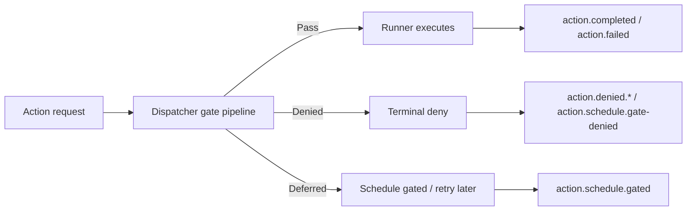

# Action gating map

This document explains how the centralized gating pipeline classifies a request
before a capability runner executes.

It is the canonical mapping for:

- **happy path**: request is allowed and reaches the runner
- **denied**: request is blocked permanently by a gate
- **deferred / gated**: request is not executed now, but is not a failure

## Actors

| Actor | Responsibility |
|---|---|
| Web intake | Validates the request, resolves identity, enqueues the action |
| Proc dispatcher | Runs the gate pipeline before dispatching to a runner |
| Gate pipeline | Applies cross-cutting policy: schedule/wave, device group, user group |
| Runner | Executes only the capability-specific work |
| Client | Shows the user-facing outcome |
| Portal | Aggregates denied/deferred telemetry and audit |

## Decision model

The important invariant is that **policy happens before execution**.
Capability runners must never re-implement group or wave checks.

## Event catalog

| Event | Meaning | Terminal? | Notes |
|---|---|---:|---|
| `action.request.received` | Request entered the system | No | Intake boundary |
| `action.request.accepted` | Request passed intake and was queued | No | Pre-dispatch |
| `action.gate.passed` | Central gate allowed the request | No | Internal pipeline signal |
| `action.schedule.gate-denied` | Request is outside the allowed wave | Yes | Counts as denied |
| `action.schedule.gated` | Request is deferred by schedule policy | No | Not a failure |
| `action.denied.device-not-in-allowed-group` | Device group gate denied the request | Yes | Counts as denied |
| `action.denied.user-not-in-allowed-group` | User group gate denied the request | Yes | Counts as denied |
| `action.completed` | Capability finished successfully | Yes | Normal terminal success |
| `action.failed` | Capability failed permanently | Yes | Normal terminal failure |
| `action.poll-timeout` | Poller could not observe a terminal state | Yes | Operational timeout |

## Semantics

### Pass

The request is allowed to continue to the runner. No special UI handling is
needed beyond normal progress and success states.

### Denied

The request is rejected permanently by a gate. The client should show the
reason, and the portal should count it in denied metrics.

Typical reasons:

- not in the enrolled wave
- device not in the allowed group
- user not in the allowed group
- device binding / identity mismatch

### Deferred

The request is not executed now, but the system is not saying "never".
The user-facing copy should be closer to "outside the current wave, retry
later" than to "blocked".

## Consumer rules

### Client

- show denied reasons explicitly
- keep deferred/schedule-gated separate from denied
- use the correlation id as the support anchor

### Portal

- include `action.schedule.gate-denied` in denied breakdowns
- use `scheduleGateReason` when `reason` is missing
- treat deferred events as a different class from denied

### Telemetry

- do not rely only on `action.denied.*`
- always include the schedule gate event explicitly
- query by exact event name when the distinction matters

## Reference implementation

- `src/Proc/Functions/ActionDispatchFunction.cs`
- `src/Shared/Gates/*`
- `src/Capabilities.Wipe/Runners/WipeActionRunner.cs`
- `client/intune-win32-package/source/Launch-Wipe.ps1`
- `client/intune-win32-package/source/WipeResultDialogs.ps1`
- `docs/wipe-message-flow.md`

